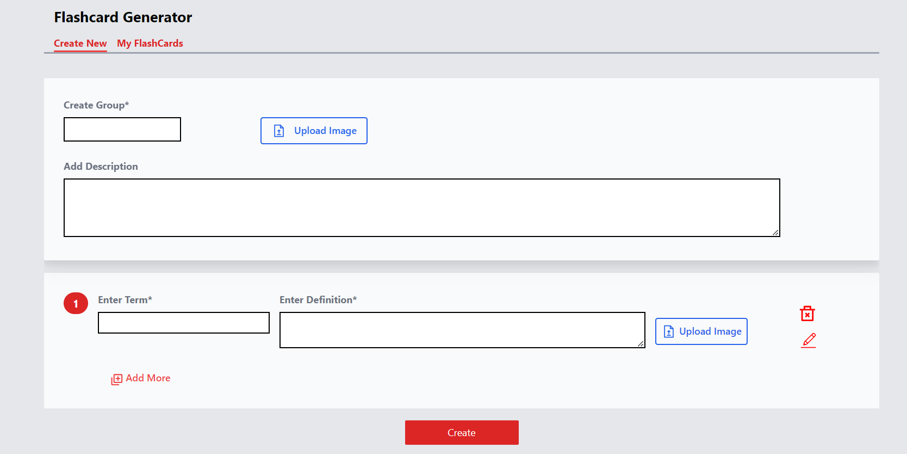

# Flashcard Generator

Flashcard Generator is a web application that allows users to create, manage, and download flashcards for efficient learning.

##  About Me
###  Hi, I'm Amrish! 👋
#### I'm a full stack developer[MERN]...

[](https://www.amrishpratapsingh.com/)    [](https://www.linkedin.com/in/amrishkush/) 

## Features

- Create and manage flashcards
- Group flashcards into pages
- Preview flashcards before downloading
- Export flashcards in PDF format
- Responsive design for various screen sizes
- Print the flashcards.

## Installation

1. Clone the repository:

   ```bash
   git clone https://github.com/your-username/flashcardgenerator.git

   ```

2. Navigate to the project directory:

   ```bash
   cd flashcardgenerator

   ```

3. Install dependencies:

   ```bash
   npm install

   ```

## Usage

1. Start the development server:

   ```bash
   npm run dev
   ```

## Technologies Used

- React.js
- Vite
- React Router
- Redux Toolkit
- Formik and Yup for form handling
- @react-pdf/renderer for PDF generation
- Jest and Testing Library for testing
- Tailwind CSS for styling

## Project Structure

 - **public/**
 - **src/**
    - **__tests__/**
        - CreatePage.jsx
        - FlashCardPage.jsx
        - MyModal.jsx
        - PrintDownloadData.jsx
    - **components/**
        - CreateFlashCard.jsx
        - CreateGroup.jsx
        - Group.jsx
        - groupImage.png
    - **features/**
        - MyModal.jsx
        - PrintDownloadData.jsx
    - **pages/**
        - CreatePage.jsx
        - FlashCardPage.jsx
        - MyFlashcard.jsx
    - **redux/**
        - **features/**
            - cardSlice.js
        - store.js
   
## Screenshot



## Demo
Click to Visit!
[FlashcardGenerator](https://flashcardgeneratoramrish.netlify.app)
